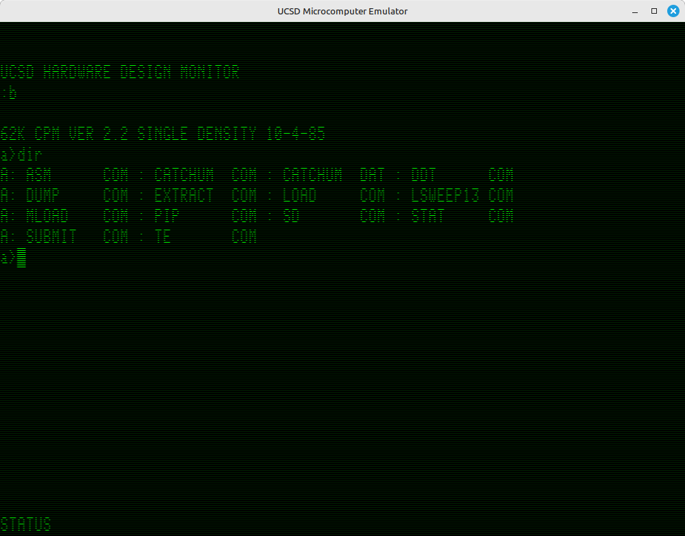
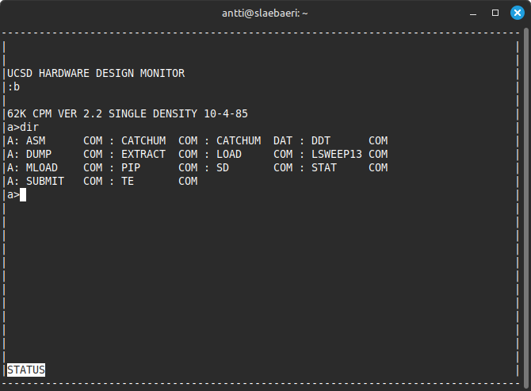

# Emulator for UCSD microcomputer

An emulator for a forgotten Z80-based single board CP/M computer, designed by Chris Poulos in 1985. Apparently Chris Poulos taught a microcomputer engineering class at the UCSD Extension Program in the fall of 1985.

In addition to the emulator, documentation regarding the computer is also gathered here. Most of it is from the course notes of a person who took the course back then and built the computer. The rest is from investigating the existing artifacts.

My available documentation does not have a consistent name for the machine. The PCB is labeled with "MICROCOMPUTER SYSTEM INTEGRATION (C) Chris Poulos, MSEE 6/85". The parts list of the machine just refers to it as "CP/M System". The ROM monitor program displays the message "UCSD HARDWARE DESIGN MONITOR".

## Prerequisites

- A C/C++ compiler which supports C++20 (specifically `std::format`)

- cmake

- libZ80 (https://zxe.io/software/Z80)

- zasm (https://github.com/Megatokio/zasm)

- SDL (optional)

- screen (optional)

- python3

- cpmtools

Note: `Z80` and its dependency `Zeta` as well as `zasm` are included as submodules of this repository, which can be used for building them.

### Ubuntu specific instructions

#### Install the repository for libZ80
```sh
curl -L https://zxe.io/scripts/add-zxe-apt-repo.sh | sudo sh
sudo apt update
```

#### Install required packages

```sh
sudo apt install build-essential cmake cpmtools libz80-dev libsdl2-dev screen
```

#### Build zasm

In the root of this repository:

```sh
git submodule update --init --recursive
cd tools/zasm
make
```
This results in the executable binary `zasm`. The emulator build system will automatically find the `zasm` binary if it is in `tools/zasm` or placed in a directory which is in the `PATH`. Alternatively, you can specify the location of the binary when configuring the emulator build system.

## Building the emulator

In the root of this repository:

```sh
mkdir build
cd build
cmake ..
make
make install
```

This will build the emulator in a the subdirectory `build`, and install it in the `deploy` subdirectory. The generated executable binary is called `ucsd_emu`.

### Build options

#### SDL

If you don't want to use the SDL based input/output method, you can disable it by specifying the option `USE_SDL=OFF`. You'll want to disable this if you don't have SDL on your system.

Example (issue in the build directory):
```sh
cmake -DUSE_SDL=OFF
make
```

#### PTY

If you don't want to use the PTY based input/output method, you can disable it by specifying the option `USE_PTY=OFF`. You'll might want to disable this if you're not running Linux.

Example (issue in the build directory):
```sh
cmake -DUSE_PTY=OFF
make
```

#### CLI

If you don't want to enable the interactive command line of the emulator (allowing switching disk images, resetting, e.g.), you can disable it by specifying the option `ENABLE_CLI=OFF`. You'll might want to disable this if you're not running Linux.

Example (issue in the build directory):
```sh
cmake -DENABLE_CLI=OFF
make
```

#### Zasm binary location

The option `ZASM` allows specifying the location of the Zasm assemler binary, if it was not placed to a directory in the `PATH`.

Example (issue in the build directory):
```sh
cmake -DZASM=~/zasm/zasm ..
make
```

### Emscripten

The emulator also features preliminary [Emscripten](https://emscripten.org/) support. This allows the emulator to be compiled into [WebAssembly](https://webassembly.org/) byte code and be run in a web browser.

#### Very cursory instructions

Install the Emscripted SDK and activate it.

In the root of this repository:

```sh
mkdir embuild
cd embuild
emcmake cmake ..
emmake make
emmake make install
```

This will build the emulator in a the subdirectory `embuild`, and install it in the `deploy` subdirectory. This generates `ucsd_emu.wasm`, `ucsd_emu.js` and `ucsd_emu.html`. Note that browsers will not load executables from the local file system. The files must be properly served for some reason.

## Emulator usage

Running `ucsd_emu` will load the ROM image `zmon.bin` and disk image `disk.bin`, and start the emulation. This results in output similar to:
```
Terminal is at /dev/pts/4
>
```
This is a command prompt, which allows giving some commands to the emulator. Issue the command `help` to see a list of commands. The emulator is now running.

If you have compiled the emulator with SDL support (default), you will also see a new graphical window open which emulates the output of the CRT9028 as well as the keyboard input of the machine.



Altarnatively, if you only have PTY output enabled, then to interact with the actual terminal of the machine, you must first open a new terminal on your computer. The terminal should be able to show at least 82 x 27 characters. You can then attach to the terminal device using the program `screen`:
```
screen /dev/pts/XXX
```
where XXX is the PTY device indicated by the emulator.



## Machine basics

The computer is surprisingly capable for the amount of components it has. The main components are:

- Z80 CPU
- 64kB of RAM
- 2kB up to 64kB of ROM
- CRT9028 CRT controller
- WD2973 disk controller
- Parallel printer port
- ASCII keyboard input

The RAM is simply the entire address space of the processor.

An interesting feature is that coming out of reset, the ROM is mapped to 0000h through 1FFFh. While the ROM is mapped, any address in RAM can be written to, but any reads in the ROM range will come from the ROM.

Z80 starts execution at 0000h. This address thus must contain some type of bootloader, which copies the ZMON monitor program from ROM into F800h where it resides during execution. Unfortunately, the ROM I have has resisted recent attempts to read it, and it may be damaged.

The ROM gets unmapped from memory once any read is performed on the IO bus. The ROM will only get remapped via pressing the reset button.

## Machine usage

The machine boots into ZMON, which is a monitor program that gets loaded into F800.

The monitor prints the message "UCSD HARDWARE DESIGN MONITOR", and presents the user with a prompt. The normal command to start the boot is to press 'b' on the keyboard.

## Disk format

The disks are single-sided 8-inch soft-sectored floppies. The disk controller supports MFM, but is configured for FM only. The drives are 77 tracks total at 48 tracks per inch.

Based on ZMON/CB/ZBIOS disk routines, as well as the CP/M config (in ZBIOS), the disk format is:
- 128 bytes per sector
- 26 sectors per track
- Sector skew of 6

The total is defined as 243 kilobytes. This would imply that the last track (track 76) has only 8 sectors. These settings would appear to make the disk compatible with cpmtools zen9 configuration.

The format remains to be verified with a real disk image.

Tracks 0 and 1 are reserved. They contain CB and ZBIOS for bootable disks. The directory structure is on track 2.

## Boot description

When the `b` command is given in the monitor, the monitor will read sector 1 of track 0 into 0080 and jump into 0080. This program is called CB in the documentation.

CB then loads sectors 2 through 26 from track 0, followed by sectors 1 through 26 from track 1, all sequentially into DC00h.  This read contains both the ZBIOS program loaded at F200h, as well as the CP/M CCP loaded at C200h and BDOS loaded at E400h. A jump to F200h is then initiated, where the CP/M cold boot vector resides.

## Monitor commands

In addition to the `b` command to boot, the monitor supports at least the following commands

- `G`: Go
    - Start execution at given addess
    - Allows specifying an optional break point
    - Example: `G 0000` <- start execution at 0000h
    - Example: `G a000/a001` <- start execution at A000h, but break at A001h
- `DR`: Display registers
    - Shows the register values
    - Example: `DR` <- show all of the registers
- `DM`: Display memory
    - Show memory contents between two addresses
    - Example: `DM f800 f8ff` <- display memory from F800h up to and including F8FFh

## Alternate monitor

The original ZMON ROM functionality has some quirks with the terminal emulation. An alternative ROM ALTMON is developed within this emulator project as `altmon.bin`. This is built as part of the emulator build process, and the CLI of the emulator allows switching the ROM image for `altmon.bin`. This ROM will then be taken into use after a reset of the machine through the CLI.

## Assembler

The original assembler appears to have been Cromemco CDOS Z80 Assembler version 02.15.
This assembler appears to have supported some non-common instruction syntaxes that have been used in the assembly files. Namely:
- Labels without a semicolon after the name
- ADC A <- standard syntax of ADC has two operands
- OR A,80H <- standard syntax of OR takes a single operand
- AND A,7FH <- standard syntax of AND takes a single operand
- `''''` is used to denote the ASCII code of the apostrophe, i.e. 27h

Turns out that the Günter Woigk's zasm supports these peculiarities, except the last one, and can directly process most of the original files.

## References

https://www.seasip.info/Cpm/format22.html#:~:text=CP%2FM%202.2%20works%20with,track%20DEFB%20bsh%20%3BBlock%20shift.

http://www.primrosebank.net/computers/cpm/cpm_structure.htm

